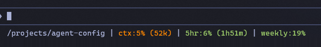

# agent-config

Claude Code configuration: coding standards, git hooks, slash commands, and skills.

## What's here

- **standards/** — Code quality rules loaded by `/code-review`: naming, testing, duplication, module depth, dependency discipline, UI preferences.
- **hooks/** — Pre-commit secret scanning (filename, regex, gitleaks).
- **commands/** — Slash commands for code review (`code-review` plus the layered multi-agent `deep-code-review`), release checklists, cloud agent briefs, Chrome extension scaffolding, and pre-public-repo audits.
- **skills/** — Agent skills: `idea` (vague → grilled spec → plan), `run-plan` (subagent execution), `to-issues`, `grill-me`, `debug` (root-cause-first investigation).
- **CLAUDE.md** — Global conventions cloned in as `~/.claude/CLAUDE.md`: scope discipline, two-strike rule, git workflow, permission hygiene.
- **settings.json** — Claude Code settings: default model, permission allowlist + default mode, and statusline wiring.
- **statusline.py** — Optional Claude Code status line script showing session usage metrics.
- **gitleaks.toml** — Secret pattern rules for the pre-commit scan.
- **network-allowlist.conf** — Squid ACL entries used by [agent-sandbox](https://github.com/curtyo18/agent-sandbox).

## Using this

Clone into `~/.claude`:

```bash
git clone https://github.com/curtyo18/agent-config.git ~/.claude
```

Or let [agent-sandbox](https://github.com/curtyo18/agent-sandbox) do it automatically on container start.

> **Heads-up on defaults.** `settings.json` ships permissive defaults (`bypassPermissions`,
> `skipDangerousModePermissionPrompt`) tuned for the agent-sandbox container, where the container
> *is* the sandbox. If you clone this standalone onto a host, review `settings.json` first —
> outside the sandbox you'll likely want a stricter `permissions.defaultMode`.

## Status line

`statusline.py` renders session usage metrics in the Claude Code status bar:

<!-- Screenshot pending. Drop the image at docs/statusline.png, then replace the line below with:
      -->
> 📸 _Status-line screenshot coming soon._

## Planning & execution skills

Self-contained — no plugin dependency; clone the repo and they work as-is. `idea` is the front
door (vague idea → grilled spec → numbered plan → handoff menu); `run-plan` executes the plan via
per-task subagent dispatch with two-stage review (or inline); `to-issues` converts it to GitHub
issues instead; `grill-me` (a relentless-interview approach inspired by Matt Pocock) drives the
questioning in `idea`'s shaping and grilling phases and also runs standalone to stress-test a plan
or design. They compose, but each stands alone. (Reimplemented from what the *superpowers* plugin
used to provide.)

## Adapting it

Fork and edit directly. The standards, hooks, and commands are designed to be modified — they represent opinions, not rules.
